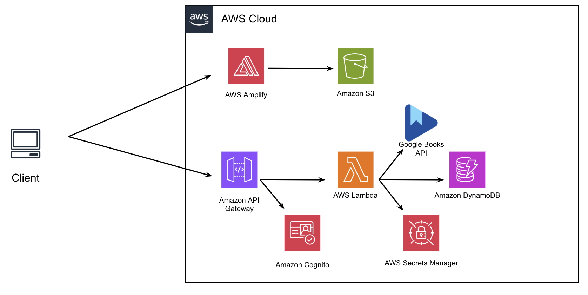

# reading_tracker_apigateway



## Overview

This project implements a web application where users can search for books using the Google Books API and store selected books in a DynamoDB table. The application serves a frontend hosted in an S3 bucket, with a backend implemented using Cloud9, AWS Lambda functions, API Gateway, and DynamoDB for data storage. The architecture is serverless, with Lambda functions handling book search, saving, and shelving operations.

## Project Setup and Configurations

### s3
- Creation of s3 Bucket is needed and modification of last line in the update_index.sh file to have user bucket name:
```
aws s3 cp index.html s3://<Enter s3 bucket name>
```

### S3 Bucket Creation and Configuration

1. Create a bucket for the application:

  * **Name**:  Remember, names must be *globally unique*.  I recommend a name like `voting399-<last name>`. 
  * **Public Access**: Deselect "Block all public access" and then click the acknowledgement that appears below this option.


2. In the list of buckets, select the bucket to see the information about the bucket.  Under **Permissions** click "Edit" for the "Bucket Policy".  Add the following policy to allow anyone to GET objects in the bucket (change `<bucket name>`):


  ```
  {
      "Version": "2012-10-17",
      "Statement": [
          {
              "Sid": "PublicReadGetObject",
              "Effect": "Allow",
              "Principal": "*",
              "Action": "s3:GetObject",
              "Resource": "arn:aws:s3:::<bucket name>/*"
          }
      ]
  }
  ```
3. After the buckets creation cp the html files into the bucket for later use:
```
aws s3 cp index.html s3://<Enter s3 bucket name>

aws s3 cp callback.html s3://<Enter s3 bucket name>

aws s3 cp sign_out.html s3://<Enter s3 bucket name>
```
  


### Google Books
- To use application the google books api is required visit this link to see how to set it up:
```
https://rachelaemmer.medium.com/how-to-use-the-google-books-api-in-your-application-17a0ed7fa857
```

### Create a Secret in Secrets Manager:

Go to the AWS Secrets Manager Console:
- Open the AWS Secrets Manager Console.
Store the Secret:
- Click on Store a new secret.
- Name the secret: 
```
reading_test_key
```
- Choose Other type of secret.
- In the Key/value pairs section, add your secret.
```
For example: Key: googlebooks Value: <YOUR_GOOGLE_BOOKS_API_KEY>
```
- Click Next and give the secret a name. For example: reading_test_key.
- Optionally, set a description or other settings.
- Click Next to configure permissions.
- Review and click Store to save the secret.

### Utilize Amplify using management console
1. click "create new app"
2. Then select:
   - deploy without Git
   - click "next"
3. Enter your app name and branch name
4. Select s3 for method
   - browse the buckets and select the bucket you created for this project
5. Finally click "Save and Deploy"

**Note any changes made to the files located in the bucket need to be updated in amplify by clicking on the "deploy updates" button after you select your application name**

### **Create a Cognito User Pool**
1. Go into the create_cognito.py and fill out any info surrounded by <> examples are provided
2. Then run:
```
./create_cognito.sh
```
### Updating files to use Cognito
- In `create_books_api.py` update arn with your arn.
- In `index.html` replace `...` with your **App Client ID** and **User Pool ID**. 

### Script Permissions
- If any script files give permission denied run:
```
chmod +x <name of script file>
```

## Developer Setup

### Launch entire project with one command (Can only be done after Amplify and Cognito setup):
```
./launch_project.sh
```
## Individual Launch Steps:

### Step 1: Clone the Repository

Clone the repository into Cloud9

### Step 2: Create a Virtual Environment

Create a virtual environment to isolate dependencies.

```
python3 -m venv .venv
```
### Step 3: Activate the Virtual Environment
Activate the virtual environment.

```
source .venv/bin/activate
```

### Step 4: Install the Required Dependencies
Install the required dependencies from the requirements.txt file.

```
pip install -r requirements.txt
```
## Deploy

### Step 5: Create Dynamodb table

```
./create_dynamodb.sh
```

### Step 6: Create Lambda Functions
You need to create several Lambda functions for handling different aspects of the bookshelf application:

Create the Lambda function for saving books.

```
./create_saved_books_lambda.1.sh
```

Create the Lambda function for searching books.

```
./create_search_books_lambda.sh
```

Create the Lambda function for shelving books.

```
./create_shelved_books_lambda.sh
```

### Step 7: Create the API Gateway
Once the Lambda functions are set up, create the API Gateway and configure the backend API.

```
python create_books_api.py
```

### Step 8: Deploy the API
Deploy the API to make it accessible.


```
./deploy.sh
```

### Step 9: Update the index.html in the S3 Bucket
After deployment, update the index.html file in the S3 bucket to reflect the latest changes.

```
./update_index.sh
```

### Step 10: Got to s3 Bucket URL
- Go to s3 click on the bucket you created for this process
- Click on the properties tab
- Scroll to the bottom of the page
- Click the s3 bucket link

## Updating the System
If any updates are made to the apigateway,index.html or lambda functions use:
```
./update_system.sh
```
This will update the index.html in the s3 bucket and delete and redeploy the apigateway and lambda functions to AWS

## Testing

### Test the Lambda Function
Once the API and Lambda functions are set up, you can test them using the provided test script.

```
./test.sh
```

## Tear Down

To issue a complete tear down of the system:

```
./tear_down.sh
```
